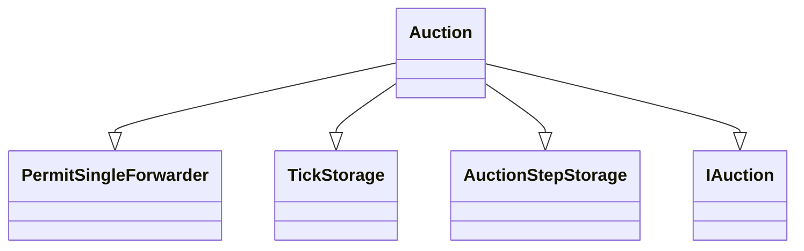
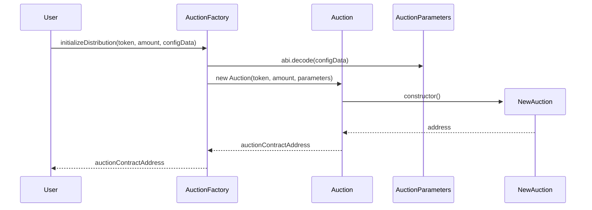
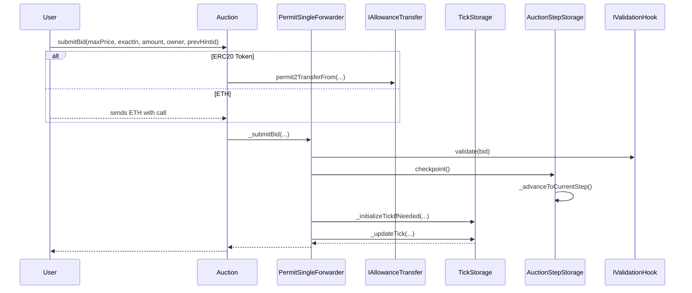

```mermaid
graph TD;
    subgraph Contracts
        AuctionFactory;
        Auction;
        AuctionStepStorage;
        TickStorage;
        PermitSingleForwarder;
    end

    subgraph Libraries
        AuctionStepLib;
        BidLib;
        CurrencyLibrary;
        SSTORE2[solady/utils/SSTORE2];
        FixedPointMathLib[solady/utils/FixedPointMathLib];
        SafeTransferLib[solady/utils/SafeTransferLib];
    end

    subgraph Interfaces
        IAuction;
        IAuctionStepStorage;
        ITickStorage;
        IPermitSingleForwarder;
        IValidationHook;
        IDistributionContract;
        IDistributionStrategy;
        IERC20Minimal;
        IAllowanceTransfer[permit2/IAllowanceTransfer];
    end

    AuctionFactory -- creates --> Auction;
    AuctionFactory -- implements --> IDistributionStrategy;

    Auction -- inherits from --> PermitSingleForwarder;
    Auction -- inherits from --> TickStorage;
    Auction -- inherits from --> AuctionStepStorage;
    Auction -- implements --> IAuction;

    Auction -- uses --> AuctionStepLib;
    Auction -- uses --> BidLib;
    Auction -- uses --> CurrencyLibrary;
    Auction -- uses --> FixedPointMathLib;
    Auction -- uses --> SafeTransferLib;

    Auction -- interacts with --> IValidationHook;
    Auction -- interacts with --> IDistributionContract;
    Auction -- interacts with --> IERC20Minimal;
    Auction -- interacts with --> IAllowanceTransfer;

    AuctionStepStorage -- uses --> AuctionStepLib;
    AuctionStepStorage -- uses --> SSTORE2;
    AuctionStepStorage -- implements --> IAuctionStepStorage;

    TickStorage -- uses --> BidLib;
    TickStorage -- implements --> ITickStorage;

    PermitSingleForwarder -- implements --> IPermitSingleForwarder;
    PermitSingleForwarder -- interacts with --> IAllowanceTransfer;
```

# TWAP Auction

This repository contains the smart contracts for a TWAP (Time-Weighted Average Price) auction mechanism.

## Installation

```bash
forge install
```

## Testing

```bash
forge test
```

### Architecture



### Contract Inheritance for Auction.sol



### Auction Construction Flow



### Bid Submission Flow


