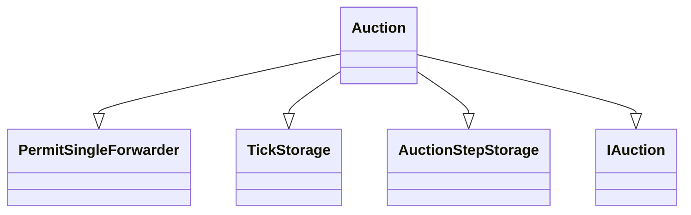
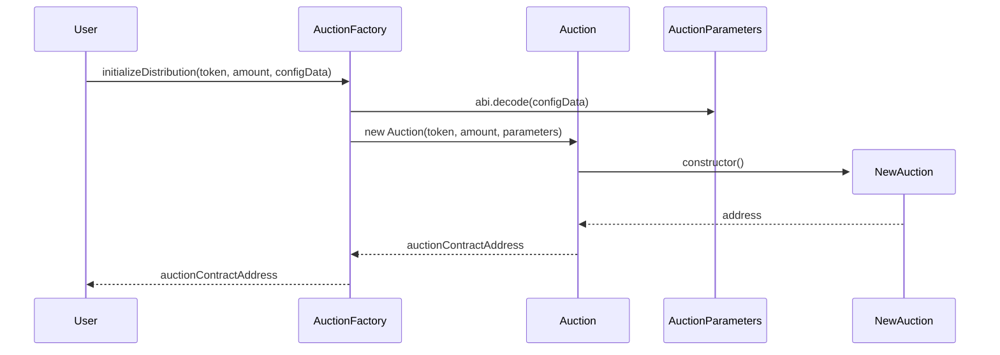
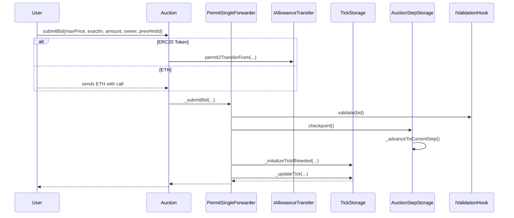
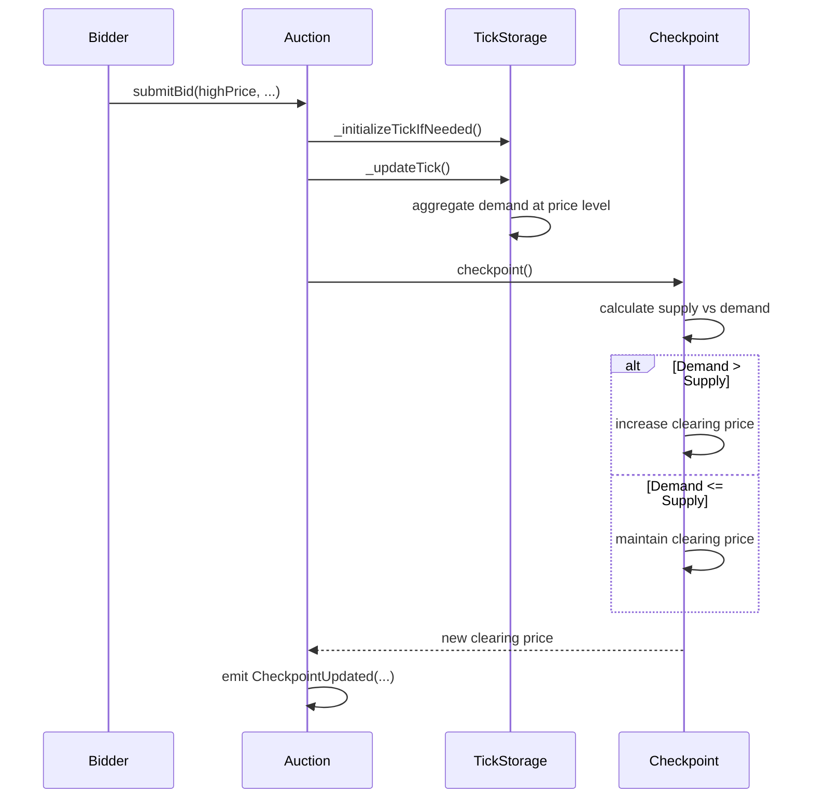

# TWAP Auction

This repository contains the smart contracts for a TWAP (Time-Weighted Average Price) auction mechanism.

## Installation

```bash
forge install
```

## Testing

```bash
forge test
```

## Architecture

```mermaid
graph TD;
    subgraph Contracts
        AuctionFactory;
        Auction;
        AuctionStepStorage;
        TickStorage;
        PermitSingleForwarder;
    end

    subgraph Libraries
        AuctionStepLib;
        BidLib;
        CurrencyLibrary;
        SSTORE2[solady/utils/SSTORE2];
        FixedPointMathLib[solady/utils/FixedPointMathLib];
        SafeTransferLib[solady/utils/SafeTransferLib];
    end

    subgraph Interfaces
        IAuction;
        IAuctionStepStorage;
        ITickStorage;
        IPermitSingleForwarder;
        IValidationHook;
        IDistributionContract;
        IDistributionStrategy;
        IERC20Minimal;
        IAllowanceTransfer[permit2/IAllowanceTransfer];
    end

    AuctionFactory -- creates --> Auction;
    AuctionFactory -- implements --> IDistributionStrategy;

    Auction -- inherits from --> PermitSingleForwarder;
    Auction -- inherits from --> TickStorage;
    Auction -- inherits from --> AuctionStepStorage;
    Auction -- implements --> IAuction;

    Auction -- uses --> AuctionStepLib;
    Auction -- uses --> BidLib;
    Auction -- uses --> CurrencyLibrary;
    Auction -- uses --> FixedPointMathLib;
    Auction -- uses --> SafeTransferLib;

    Auction -- interacts with --> IValidationHook;
    Auction -- interacts with --> IDistributionContract;
    Auction -- interacts with --> IERC20Minimal;
    Auction -- interacts with --> IAllowanceTransfer;

    AuctionStepStorage -- uses --> AuctionStepLib;
    AuctionStepStorage -- uses --> SSTORE2;
    AuctionStepStorage -- implements --> IAuctionStepStorage;

    TickStorage -- uses --> BidLib;
    TickStorage -- implements --> ITickStorage;

    PermitSingleForwarder -- implements --> IPermitSingleForwarder;
    PermitSingleForwarder -- interacts with --> IAllowanceTransfer;
```



## Contract Inheritance for Auction.sol



## Auction Functions

### Setup and Configuration

The auction and its supply curve are configured through the AuctionFactory which deploys individual Auction contracts with configurable parameters.

```solidity
interface IAuctionFactory {
    function initializeDistribution(
        address token,
        uint256 amount,
        bytes calldata configData
    ) external returns (address);
}
```

**Implementation**: The factory decodes `configData` into `AuctionParameters` containing the step function data (MPS schedule), price parameters, and timing configuration. The step function defines how many tokens are released per block over time.

### Validation Hooks

Optional validation hooks allow custom logic to be executed before bids are accepted, enabling features like allowlists, rate limiting, or complex validation rules.

```solidity
interface IValidationHook {
    function validate(Bid calldata bid) external view;
}
```

**Implementation**: If a validation hook is configured during auction deployment, it is called during `_submitBid()` and must not revert for the bid to be accepted.

### Bid Submission

Users can submit bids specifying either exact currency input or exact token output desired. The bid id is returned to the user and can be used to claim tokens or withdraw the bid. The `prevHintId` parameter is used to determine the location of the tick to insert the bid into.

```solidity
interface IAuction {
    function submitBid(
        uint128 maxPrice,
        bool exactIn,
        uint256 amount,
        address owner,
        uint128 prevHintId
    ) external payable;
}

event BidSubmitted(uint256 bidId, address owner, uint256 maxPrice, bool exactIn, uint256 amount);

event TickInitialized(uint128 id, uint256 price);
```

**Implementation**: Bids are validated, funds transferred via Permit2 (or ETH), ticks initialized if needed, and demand aggregated.

### Clearing price

The clearing price represents the current marginal price at which tokens are being sold. The clearing price is updated when a new bid is submitted that would change the clearing price. An event is emitted when the clearing price is updated.

```solidity
interface IAuction {
    function clearingPrice() external view returns (uint256);
}

event CheckpointUpdated(uint256 blockNumber, uint256 clearingPrice, uint256 totalCleared, uint256 cumulativeMps);
```

**Implementation**: Returns the clearing price from the most recent checkpoint.

### Claiming tokens

Users can determine their token allocation by providing a bid id along with checkpoint information.

```solidity
interface IAuction {
    function claimTokens(uint256 bidId) external;
}

event TokensClaimed(uint256 bidId, uint256 amount);
```

**Implementation**: Bids above the clearing price receive tokens proportional to time elapsed and MPS rate.


### Bid withdrawal

Users can withdraw their bid if their max price is below the clearing price.

```solidity
interface IAuction {
    function withdrawBid(uint256 bidId) external;
}

event BidWithdrawn(uint256 bidId, uint256 amount);
```

**Implementation**: The bid is removed from the auction and the user is refunded the amount which was not sold.

### Auction information

```solidity
interface IAuctionStepStorage {
    function step() external view returns (AuctionStep memory);
    function startBlock() external view returns (uint64);
    function endBlock() external view returns (uint64);
}

interface IAuction {
    function totalSupply() external view returns (uint256);
}
```

**Implementation**: Current step contains MPS (tokens per block), start/end blocks. Total supply is immutable.

## Flow Diagrams

### Auction Construction Flow



### Bid Submission Flow



### Clearing price update flow


