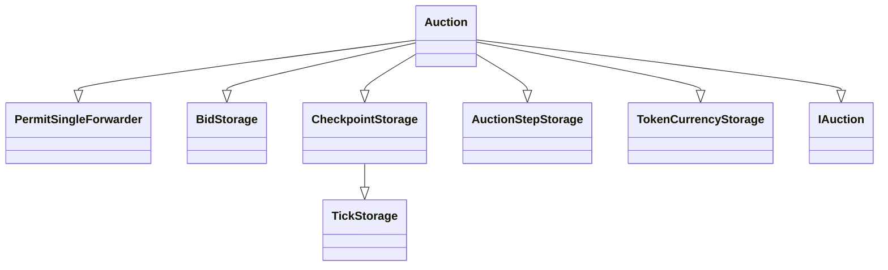
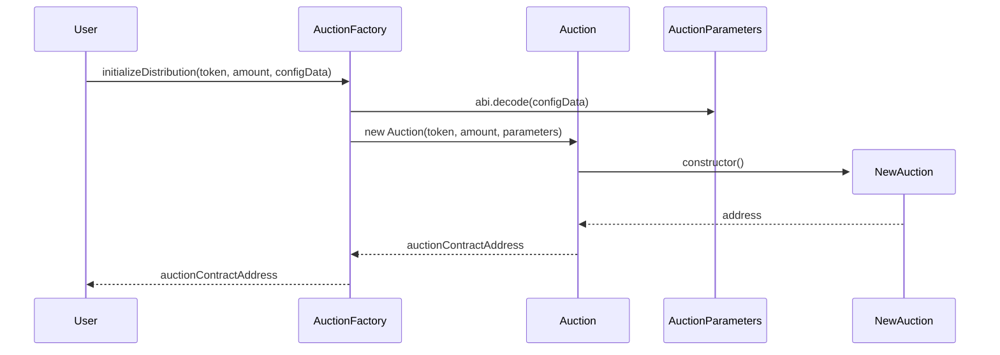
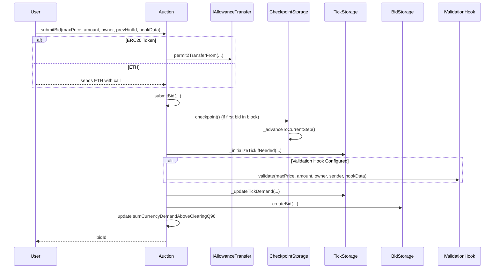
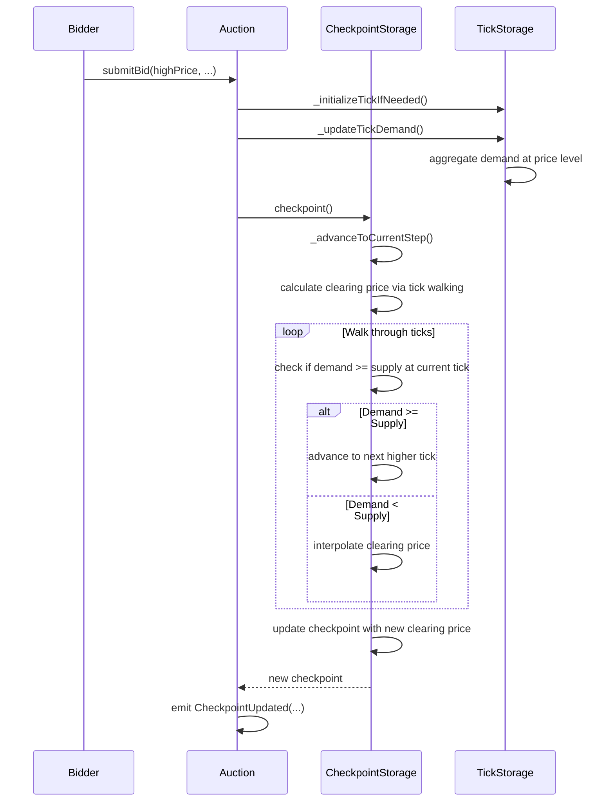
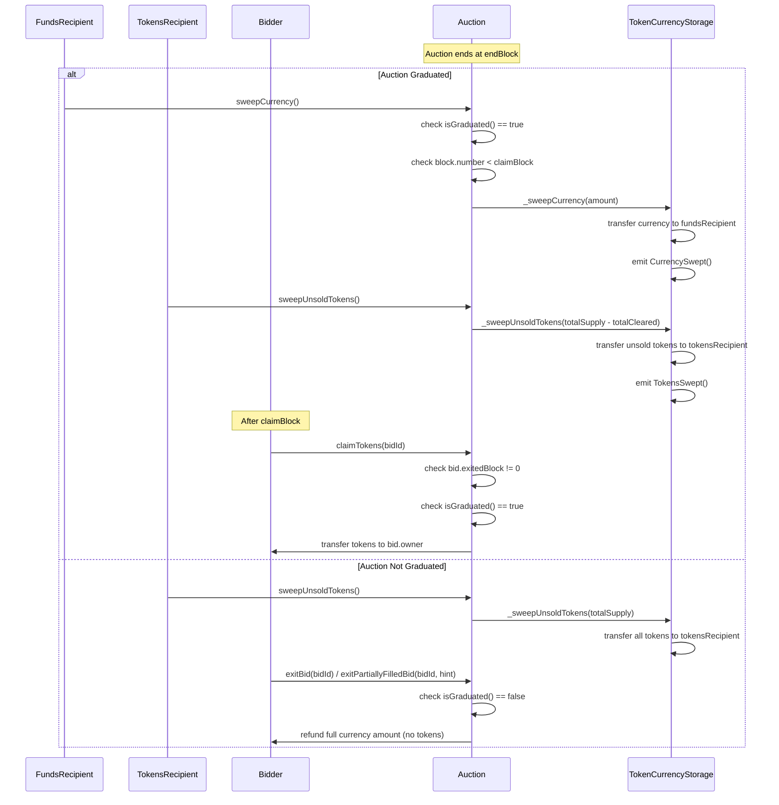

# Continuous Clearing Auction

This repository contains the smart contracts for a Continuous Clearing Auction mechanism.

## Installation

```bash
forge install
```

## Testing

```bash
forge test
```

## Architecture

```mermaid
graph TD;
    subgraph Contracts
        AuctionFactory;
        Auction;
        AuctionStepStorage;
        BidStorage;
        CheckpointStorage;
        TickStorage;
        PermitSingleForwarder;
        TokenCurrencyStorage;
    end

    subgraph Libraries
        AuctionStepLib;
        BidLib;
        CheckpointLib;
        CurrencyLibrary;
        ValueX7Lib;
        SupplyLib;
        ValidationHookLib;
        FixedPoint96;
        SSTORE2[solady/utils/SSTORE2];
        FixedPointMathLib[solady/utils/FixedPointMathLib];
        SafeTransferLib[solady/utils/SafeTransferLib];
    end

    subgraph Interfaces
        IAuction;
        IAuctionStepStorage;
        ITickStorage;
        ICheckpointStorage;
        ITokenCurrencyStorage;
        IPermitSingleForwarder;
        IValidationHook;
        IDistributionContract;
        IDistributionStrategy;
        IERC20Minimal;
        IAllowanceTransfer[permit2/IAllowanceTransfer];
    end

    AuctionFactory -- creates --> Auction;
    AuctionFactory -- implements --> IDistributionStrategy;

    Auction -- inherits from --> PermitSingleForwarder;
    Auction -- inherits from --> BidStorage;
    Auction -- inherits from --> CheckpointStorage;
    Auction -- inherits from --> AuctionStepStorage;
    Auction -- inherits from --> TokenCurrencyStorage;
    Auction -- implements --> IAuction;

    CheckpointStorage -- inherits from --> TickStorage;
    BidStorage -- uses --> BidLib;

    Auction -- uses --> AuctionStepLib;
    Auction -- uses --> BidLib;
    Auction -- uses --> CheckpointLib;
    Auction -- uses --> CurrencyLibrary;
    Auction -- uses --> FixedPoint96;
    Auction -- uses --> FixedPointMathLib;
    Auction -- uses --> SafeTransferLib;
    Auction -- uses --> ValueX7Lib;
    Auction -- uses --> SupplyLib;
    Auction -- uses --> ValidationHookLib;

    Auction -- interacts with --> IValidationHook;
    Auction -- interacts with --> IDistributionContract;
    Auction -- interacts with --> IERC20Minimal;
    Auction -- interacts with --> IAllowanceTransfer;

    AuctionStepStorage -- uses --> AuctionStepLib;
    AuctionStepStorage -- uses --> SSTORE2;
    AuctionStepStorage -- implements --> IAuctionStepStorage;

    CheckpointStorage -- uses --> CheckpointLib;
    CheckpointStorage -- uses --> FixedPoint96;
    CheckpointStorage -- implements --> ICheckpointStorage;
    TickStorage -- uses --> FixedPoint96;
    TickStorage -- implements --> ITickStorage;

    TokenCurrencyStorage -- uses --> CurrencyLibrary;
    TokenCurrencyStorage -- implements --> ITokenCurrencyStorage;

    PermitSingleForwarder -- implements --> IPermitSingleForwarder;
    PermitSingleForwarder -- interacts with --> IAllowanceTransfer;
```



## Contract Inheritance for Auction.sol



## Auction Functions

### Setup and Configuration

The auction and its supply curve are configured through the AuctionFactory which deploys individual Auction contracts with configurable parameters.

```solidity
interface IAuctionFactory {
    function initializeDistribution(
        address token,
        uint256 amount,
        bytes calldata configData
    ) external returns (address);
}

/// @notice Parameters for the auction
/// @dev token and totalSupply are passed as constructor arguments
struct AuctionParameters {
    address currency; // token to raise funds in. Use address(0) for ETH
    address tokensRecipient; // address to receive leftover tokens
    address fundsRecipient; // address to receive all raised funds
    uint64 startBlock; // Block which the first step starts
    uint64 endBlock; // When the auction finishes
    uint64 claimBlock; // Block when the auction can claimed
    uint256 tickSpacing; // Fixed granularity for prices
    address validationHook; // Optional hook called before a bid
    uint256 floorPrice; // Starting floor price for the auction
    uint128 requiredCurrencyRaised; // Amount of currency required to be raised for the auction to graduate
    bytes auctionStepsData; // Packed bytes describing token issuance schedule
}

constructor(
    address _token,
    uint128 _totalSupply,
    AuctionParameters memory _parameters
) {}
```

The factory decodes `configData` into `AuctionParameters` and deploys the Auction contract via CREATE2.

## Types

### Q96 Fixed-Point Math

The auction uses Q96 fixed-point arithmetic for price and demand representation:

```solidity
library FixedPoint96 {
    uint8 internal constant RESOLUTION = 96;
    uint256 internal constant Q96 = 0x1000000000000000000000000; // 2^96
}
```

- **Price**: Stored as as a Q96 fixed point number to allow for fractional prices
- **Demand**: Currency amounts are scaled by Q96 to prevent significant precision loss in calculations

#### MPS terms (Milli-Basis Points)

**MPS = 1e7** (10 million), each representing one thousandth of a basis point:

```solidity
library ConstantsLib {
    uint24 public constant MPS = 1e7; // 10,000,000
}
```

#### ValueX7

A custom uint256 type that represents values which have either been implicitly or explicitly multiplied by 1e7 (ConstantsLib.MPS). These values will be suffixed in the code with `_X7` for clarity.

```solidity
/// @notice A ValueX7 is a uint256 value that has been multiplied by MPS
/// @dev X7 values are used for supply values to avoid intermediate division by MPS
type ValueX7 is uint256;
```

## Core logic

<details>
<summary><strong>1. Clearing Price Calculation</strong></summary>

The clearing price calculation uses currency raised instead of tokens cleared.

**Clearing Price Formula:**

The clearing price is determined by the ratio of demand to supply:

$$\text{clearingPrice} = \frac{\text{sumCurrencyDemandAboveClearingQ96}}{\text{TOTAL\_SUPPLY}}$$

**Implementation:**

```solidity
// Calculate clearing price based on demand
clearingPrice = sumCurrencyDemandAboveClearingQ96.fullMulDivUp(1, TOTAL_SUPPLY);

// Bounded by minimum clearing price (floor or last tick)
if (clearingPrice < minimumClearingPrice) {
    clearingPrice = minimumClearingPrice;
}
```

</details>

<details>
<summary><strong>2. Currency Raised Tracking</strong></summary>

Currency raised is tracked using ValueX7 scaling.

**Currency Raised Formula:**

When fully subscribed (clearing price > floor price):
$$\text{currencyRaised} = \text{totalSupply} \times \text{clearingPrice} \times \text{deltaMps} / \text{MPS}$$

When not fully subscribed (at floor price):
$$\text{currencyRaised} = \text{sumCurrencyDemandAboveClearingQ96} \times \text{deltaMps} / \text{MPS}$$

**Implementation:**

```solidity
// Default: all demand is above clearing price
currencyRaisedQ96_X7 = ValueX7.wrap($sumCurrencyDemandAboveClearingQ96 * deltaMps);

// Special case: when clearing price is at a tick boundary with bids
// Additional logic to handle partial fills at the clearing price
```

ValueX7 scaling avoids intermediate division by MPS.

</details>

#### Type Safety and Conversions

ValueX7 conversion utilities:

```solidity
// ValueX7 operations
library ValueX7Lib {
    function scaleUpToX7(uint256 value) -> ValueX7
    function scaleDownToUint256(ValueX7 value) -> uint256
    function wrapAndFullMulDiv(ValueX7 a, uint256 b, uint256 c) -> ValueX7
    function wrapAndFullMulDivUp(ValueX7 a, uint256 b, uint256 c) -> ValueX7
}
```

**Benefits**:

- Eliminates rounding errors
- Type safety for scaled values
- Avoids division operations in loops
- Exact price and allocation calculations

### Auction steps (supply issuance schedule)

The auction steps define the supply issuance schedule. The auction steps are packed into a bytes array and passed to the constructor along with the other parameters. Each step is a packed `uint64` with the first 24 bits being the per-block issuance rate in MPS (milli-bips), and the last 40 bits being the number of blocks to sell over.

```solidity
/// AuctionStepLib.sol

function parse(bytes8 data) internal pure returns (uint24 mps, uint40 blockDelta) {
    mps = uint24(bytes3(data));
    blockDelta = uint40(uint64(data));
}
```

For example, to sell 1 basis point of supply per block for 100 blocks, then 2 basis points for the next 100 blocks, the packed `uint64` would be:

```solidity
uint24 mps = 1000; // 1000 mps = 1 basis point
uint40 blockDelta = 100; // 100 blocks
bytes8 packed1 = uint64(mps) | (uint64(blockDelta) << 24);

mps = 2000; // 2000 mps = 2 basis points
blockDelta = 100; // 100 blocks
bytes8 packed2 = uint64(mps) | (uint64(blockDelta) << 24);

bytes packed = abi.encodePacked(packed1, packed2);
```

**Implementation**: The data is deployed to an external SSTORE2 contract for cheaper reads over the lifetime of the auction.

### Validation Hooks

Optional validation hooks allow custom logic to be executed before bids are accepted, enabling features like allowlists, rate limiting, or complex validation rules.

```solidity
interface IValidationHook {
    function validate(
        uint256 maxPrice,
        uint256 amount,
        address owner,
        address sender,
        bytes calldata hookData
    ) external;
}
```

**Implementation**: If a validation hook is configured during auction deployment, it is called during `_submitBid()` and must not revert for the bid to be accepted.

## Contract Entrypoints

### submitBid()

Users can submit bids specifying the currency amount they want to spend. The bid id is returned to the user and can be used to claim tokens or exit the bid. The `prevTickPrice` parameter is used to determine the location of the tick to insert the bid into. It must be the price of the tick immediately preceding it in the linked list of prices.

The `maxPrice` is the maximum price the user is willing to pay. The `amount` is the amount of currency the user is bidding, and `owner` is the address of the user who will receive any purchased tokens or refunded currency.

The Auction enforces the following rules on bid prices:

- Bids must be above the current clearing price
- Maximum bid price is capped at `type(uint256).max / TOTAL_SUPPLY`

```solidity
interface IContinuousClearingAuction {
    function submitBid(
        uint256 maxPrice,
        uint128 amount,
        address owner,
        uint256 prevTickPrice,
        bytes calldata hookData
    ) external payable returns (uint256 bidId);

    /// @notice Optional function if the maxPrice is already initialized or if the caller doesn't care about gas efficiency.
    function submitBid(
        uint256 maxPrice,
        uint128 amount,
        address owner,
        bytes calldata hookData
    ) external payable returns (uint256 bidId);
}

event BidSubmitted(uint256 indexed id, address indexed owner, uint256 price, uint256 amount);
event TickInitialized(uint256 price);
```

### checkpoint()

The auction is checkpointed once every block with a new bid. The checkpoint is a snapshot of the auction state up to (NOT including) that block. Checkpoints determine token allocation for each bid.

```solidity
interface IContinuousClearingAuction {
    function checkpoint() external returns (Checkpoint memory _checkpoint);
}

event CheckpointUpdated(uint256 indexed blockNumber, uint256 clearingPrice, ValueX7 currencyRaisedQ96_X7, uint24 cumulativeMps);
```

### exitBid()

Users can use `exitBid` to withdraw their bid after the auction has ended, or if the auction has not graduated. This function requires that a user's bid has a max price above the final clearing price of the auction. This means that the bid was never outbid or partially filled.

The bid will be fully refunded if the auction has not graduated.

```solidity
interface IContinuousClearingAuction {
    /// @notice Exit a bid where max price is above final clearing price
    function exitBid(uint256 bidId) external;
}

event BidExited(uint256 indexed bidId, address indexed owner, uint256 tokensFilled, uint256 currencyRefunded);
```

### exitPartiallyFilledBid()

Exiting partially filled bids is more complex than fully filled ones. The `exitPartiallyFilledBid` function requires the user to provide two checkpoint hints (`lastFullyFilledCheckpointBlock`, `outbidBlock`). These are used to determine the checkpoints immediately before and after the period of time in which the bid was partially filled (auction.clearingPrice == bid.maxPrice).

- `lastFullyFilledCheckpointBlock`: Last checkpoint where clearing price is strictly < bid.maxPrice
- `outbidBlock`: First checkpoint where clearing price is strictly > bid.maxPrice, or 0 if the bid was not outbid at the end of the auction.

Diagram showing the checkpoints:

```solidity
        /**
         * Account for partially filled checkpoints
         *
         *                 <-- fully filled ->  <- partially filled ---------->  INACTIVE
         *                | ----------------- | -------- | ------------------- | ------ |
         *                ^                   ^          ^                     ^        ^
         *              start       lastFullyFilled   lastFullyFilled.next    upper    outbid
         *
         * Instantly partial fill case:
         *
         *                <- partially filled ----------------------------->  INACTIVE
         *                | ----------------- | --------------------------- | ------ |
         *                ^                   ^                             ^        ^
         *              start          lastFullyFilled.next               upper    outbid
         *           lastFullyFilled
         *
         */
```

Checkpoints also store a cumulative value (`currencyRaisedAtClearingPriceQ96_X7`) which tracks the amount of currency raised from bids at the clearing price. This is reset every time the clearing price changes, but we can use the value to figure out the user's pro-rata share of the tokens sold at the clearing price.

## Utility / view functions

### isGraduated()

Auctions are "graduated" if the currency raised meets or exceeds the required threshold set by the auction launcher on deployment.

A core invariant of the auction is that no bids can be withdrawn before the auction has graduated.

```solidity
interface IContinuousClearingAuction {
    /// @notice Whether the auction has graduated (currency raised >= required)
    function isGraduated() external view returns (bool);
}
```

### sweepCurrency() and sweepUnsoldTokens()

After an auction ends, raised currency and unsold tokens can be withdrawn to the designated recipients in the auction deployment parameters.

```solidity
interface IContinuousClearingAuction {
    /// @notice Withdraw all raised currency (only for graduated auctions)
    function sweepCurrency() external;

    /// @notice Withdraw any unsold tokens
    function sweepUnsoldTokens() external;
}

event CurrencySwept(address indexed fundsRecipient, uint256 currencyAmount);
event TokensSwept(address indexed tokensRecipient, uint256 tokensAmount);
```

Note:

- `sweepCurrency()` is only callable after the auction ends, and only for graduated auctions
- `sweepUnsoldTokens()` is callable by anyone after the auction ends and will sweep different amounts depending on graduation.
- For graduated auctions: sweeps no tokens (all were sold)
- For non-graduated auctions: sweeps all `totalSupply` tokens

### claimTokens()

Users can claim their purchased tokens after the auction's claim block. The bid must be exited before claiming tokens, and the auction must have graduated.

```solidity
interface IContinuousClearingAuction {
    function claimTokens(uint256 bidId) external;
}

event TokensClaimed(uint256 indexed bidId, address indexed owner, uint256 tokensFilled);
```

**Implementation**: Transfers tokens to bid owner. Anyone can call this function. Requires bid to be exited and auction graduated.

### Auction information

```solidity
interface IAuctionStepStorage {
    function step() external view returns (AuctionStep memory);
    function startBlock() external view returns (uint64);
    function endBlock() external view returns (uint64);
}

interface IAuction {
    function totalSupply() external view returns (uint256);
    function isGraduated() external view returns (bool);
    function sumCurrencyDemandAboveClearingQ96() external view returns (uint256);
}

interface ITokenCurrencyStorage {
    function sweepCurrencyBlock() external view returns (uint256);
    function sweepUnsoldTokensBlock() external view returns (uint256);
}
```

**Implementation**: Current step contains MPS, start/end blocks. Total supply is immutable.

## Flow Diagrams

### Auction Construction Flow



### Bid Submission Flow



### Clearing price update flow



### Auction Completion and Fund Management Flow



#### Price Discovery Visualization


- **Fixed Supply**: 1,000 tokens
- **Currency Requirements**: Constant at each price level
- **Bid Restrictions**: New bids must be at or above clearing price
- **Price Discovery**: Clearing price increases as demand exceeds supply
- **Visual Indicators**: Green at clearing price, blue above, gray below
