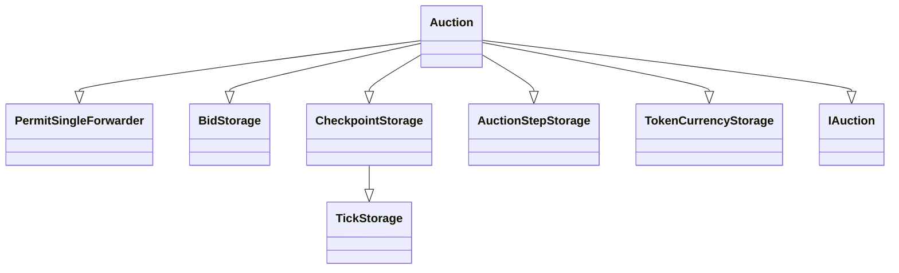
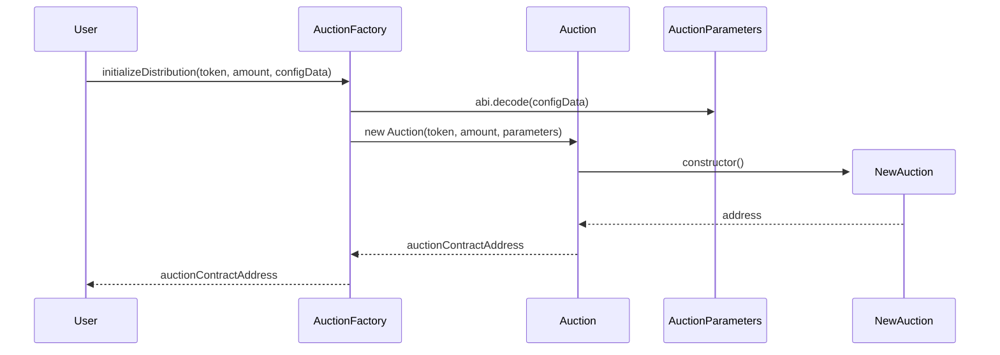
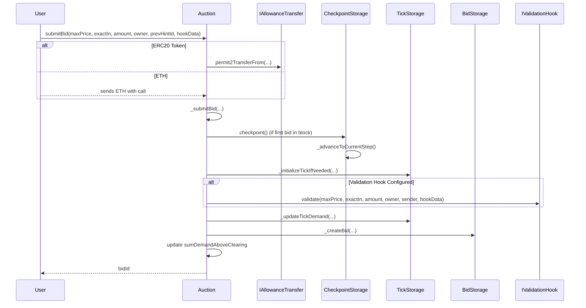
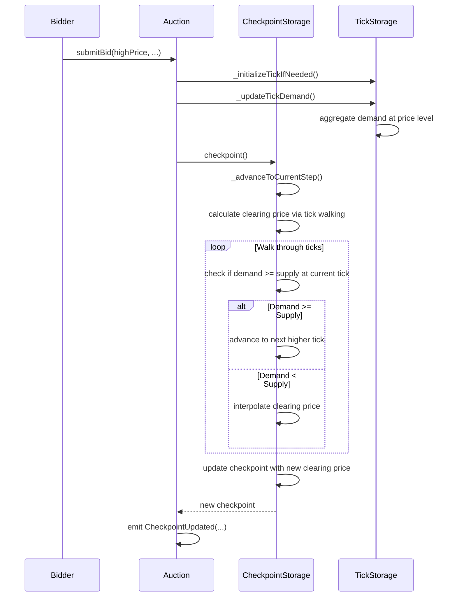
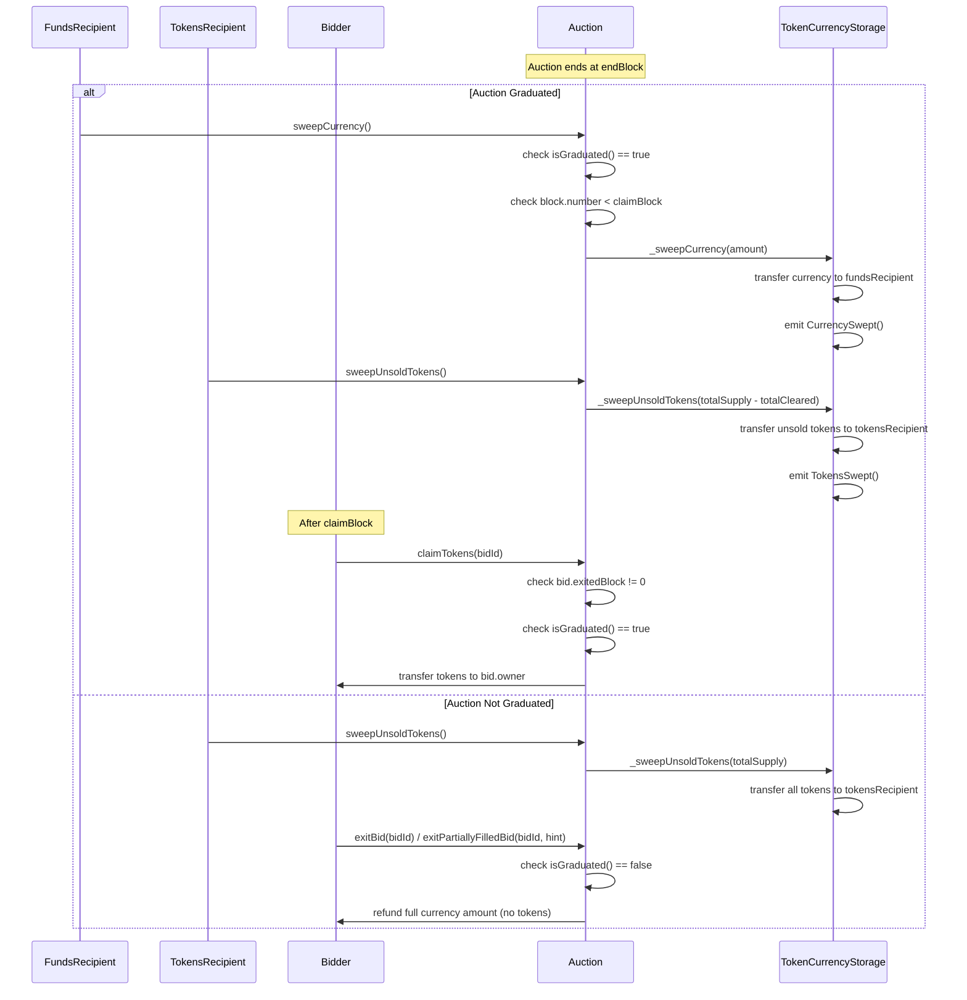

# TWAP Auction

This repository contains the smart contracts for a TWAP (Time-Weighted Average Price) auction mechanism.

## Installation

```bash
forge install
```

## Testing

```bash
forge test
```

## Architecture

```mermaid
graph TD;
    subgraph Contracts
        AuctionFactory;
        Auction;
        AuctionStepStorage;
        BidStorage;
        CheckpointStorage;
        TickStorage;
        PermitSingleForwarder;
        TokenCurrencyStorage;
    end

    subgraph Libraries
        AuctionStepLib;
        BidLib;
        CheckpointLib;
        DemandLib;
        CurrencyLibrary;
        FixedPoint96;
        SSTORE2[solady/utils/SSTORE2];
        FixedPointMathLib[solady/utils/FixedPointMathLib];
        SafeTransferLib[solady/utils/SafeTransferLib];
    end

    subgraph Interfaces
        IAuction;
        IAuctionStepStorage;
        ITickStorage;
        ICheckpointStorage;
        ITokenCurrencyStorage;
        IPermitSingleForwarder;
        IValidationHook;
        IDistributionContract;
        IDistributionStrategy;
        IERC20Minimal;
        IAllowanceTransfer[permit2/IAllowanceTransfer];
    end

    AuctionFactory -- creates --> Auction;
    AuctionFactory -- implements --> IDistributionStrategy;

    Auction -- inherits from --> PermitSingleForwarder;
    Auction -- inherits from --> BidStorage;
    Auction -- inherits from --> CheckpointStorage;
    Auction -- inherits from --> AuctionStepStorage;
    Auction -- inherits from --> TokenCurrencyStorage;
    Auction -- implements --> IAuction;

    CheckpointStorage -- inherits from --> TickStorage;
    BidStorage -- uses --> BidLib;

    Auction -- uses --> AuctionStepLib;
    Auction -- uses --> BidLib;
    Auction -- uses --> CheckpointLib;
    Auction -- uses --> DemandLib;
    Auction -- uses --> CurrencyLibrary;
    Auction -- uses --> FixedPoint96;
    Auction -- uses --> FixedPointMathLib;
    Auction -- uses --> SafeTransferLib;

    Auction -- interacts with --> IValidationHook;
    Auction -- interacts with --> IDistributionContract;
    Auction -- interacts with --> IERC20Minimal;
    Auction -- interacts with --> IAllowanceTransfer;

    AuctionStepStorage -- uses --> AuctionStepLib;
    AuctionStepStorage -- uses --> SSTORE2;
    AuctionStepStorage -- implements --> IAuctionStepStorage;

    CheckpointStorage -- uses --> CheckpointLib;
    CheckpointStorage -- uses --> DemandLib;
    CheckpointStorage -- uses --> FixedPoint96;
    CheckpointStorage -- implements --> ICheckpointStorage;
    TickStorage -- uses --> DemandLib;
    TickStorage -- uses --> FixedPoint96;
    TickStorage -- implements --> ITickStorage;

    TokenCurrencyStorage -- uses --> CurrencyLibrary;
    TokenCurrencyStorage -- implements --> ITokenCurrencyStorage;

    PermitSingleForwarder -- implements --> IPermitSingleForwarder;
    PermitSingleForwarder -- interacts with --> IAllowanceTransfer;
```



## Contract Inheritance for Auction.sol



## Auction Functions

### Setup and Configuration

The auction and its supply curve are configured through the AuctionFactory which deploys individual Auction contracts with configurable parameters.

```solidity
interface IAuctionFactory {
    function initializeDistribution(
        address token,
        uint256 amount,
        bytes calldata configData
    ) external returns (address);
}

/// @notice Parameters for the auction
/// @dev token and totalSupply are passed as constructor arguments
struct AuctionParameters {
    address currency; // token to raise funds in. Use address(0) for ETH
    address tokensRecipient; // address to receive leftover tokens
    address fundsRecipient; // address to receive all raised funds
    uint64 startBlock; // Block which the first step starts
    uint64 endBlock; // When the auction finishes
    uint64 claimBlock; // Block when the auction can claimed
    uint24 graduationThresholdMps; // Minimum percentage of tokens that must be sold to graduate the auction
    uint256 tickSpacing; // Fixed granularity for prices (in Q96 format)
    address validationHook; // Optional hook called before a bid
    uint256 floorPrice; // Starting floor price for the auction (in Q96 format)
    bytes auctionStepsData; // Packed bytes describing token issuance schedule
}

constructor(
    address _token,
    uint256 _totalSupply,
    AuctionParameters memory _parameters
) {}
```

**Implementation**: The factory decodes `configData` into `AuctionParameters` containing the step function data (MPS schedule), price parameters, and timing configuration. The step function defines how many tokens are released per block over time.

### Q96 Fixed-Point Pricing

The auction uses Q96 fixed-point arithmetic for precise price representation without rounding errors:

```solidity
library FixedPoint96 {
    uint8 internal constant RESOLUTION = 96;
    uint256 internal constant Q96 = 0x1000000000000000000000000; // 2^96
}
```

**Price Encoding**: All prices are stored as `price * 2^96` to represent exact decimal values. For example:

- A price of 1.5 tokens per currency unit = `1.5 * 2^96`
- This allows precise arithmetic without floating-point precision loss

**Implementation**: The Q96 system enables exact price calculations during clearing price discovery and bid fill accounting, ensuring no rounding errors in critical financial operations.

### X7 and X7X7 Precision Mathematics

The auction employs a sophisticated dual-scaling system to maintain mathematical precision throughout complex time-weighted calculations, avoiding intermediate rounding errors that could compound over the auction lifecycle.

#### MPS (Milli-Basis Points)

The foundation of the scaling system is **MPS = 1e7** (10 million), representing one thousandth of a basis point:

```solidity
library MPSLib {
    uint24 public constant MPS = 1e7; // 10,000,000
}
```

#### ValueX7: Demand-Side Precision

**ValueX7** represents values scaled up by MPS to preserve precision in demand calculations:

```solidity
/// @notice A ValueX7 is a uint256 value that has been multiplied by MPS
/// @dev X7 values are used for demand values to avoid intermediate division by MPS
type ValueX7 is uint256;
```

**Purpose**: Demand calculations involve fractional distributions over time and price levels. By pre-scaling demand values by MPS, the system avoids precision loss from repeated division operations.

**Use Cases**:

- Bid demand aggregation across price ticks
- Currency and token demand tracking
- Partial fill ratio calculations

#### ValueX7X7: Supply-Side Double Precision

**ValueX7X7** represents values scaled up by MPS twice (total scaling of 1e14) for supply-related calculations:

```solidity
/// @notice A ValueX7X7 is a ValueX7 value that has been multiplied by MPS
/// @dev X7X7 values are used for supply values to avoid intermediate division by MPS
type ValueX7X7 is uint256;
```

**Purpose**: Supply calculations are more complex, involving time-weighted distributions, cumulative tracking, and clearing price interactions. The double scaling ensures precision is maintained through multiple mathematical operations.

**Use Cases**:

- Total cleared supply tracking (`totalClearedX7X7`)
- Cumulative supply sold to clearing price (`cumulativeSupplySoldToClearingPriceX7X7`)
- Finding the total tokens sold in the auction for graudation threshold comparison

#### Core Mathematical Operations

The dual scaling system enables two critical mathematical operations that define the auction mechanism:

<details>
<summary><strong>1. Clearing Price Calculation</strong></summary>

The clearing price calculation finds the ratio of currency demand to available token supply, following $\text{price} = \frac{\text{currency}}{\text{tokens}}$.

**Initial Formula:**
$$\frac{\text{currencyDemandX7} \times \text{Q96} \times \text{mps}}{\text{MPS}} \div \left[ \frac{(\text{totalSupplyX7} - \text{totalClearedX7}) \times \text{mps}}{\text{MPS} - \text{cumulativeMps}} - \frac{\text{tokenDemandX7} \times \text{mps}}{\text{MPS}} \right]$$

**Algebraic Simplification Steps:**

1. **Find common denominator for the divisor:**
   $$\frac{(\text{totalSupplyX7} - \text{totalClearedX7}) \times \text{mps} \times \text{MPS} - \text{tokenDemandX7} \times \text{mps} \times (\text{MPS} - \text{cumulativeMps})}{(\text{MPS} - \text{cumulativeMps}) \times \text{MPS}}$$

2. **Convert division to multiplication:**
   $$\frac{\text{currencyDemandX7} \times \text{Q96} \times \text{mps}}{\text{MPS}} \times \frac{(\text{MPS} - \text{cumulativeMps}) \times \text{MPS}}{(\text{totalSupplyX7} - \text{totalClearedX7}) \times \text{mps} \times \text{MPS} - \text{tokenDemandX7} \times \text{mps} \times (\text{MPS} - \text{cumulativeMps})}$$

3. **Cancel common terms (mps and MPS):**
   $$\text{currencyDemandX7} \times \text{Q96} \times \frac{(\text{MPS} - \text{cumulativeMps})}{(\text{totalSupplyX7} - \text{totalClearedX7}) \times \text{MPS} - \text{tokenDemandX7} \times (\text{MPS} - \text{cumulativeMps})}$$

4. **Substitute X7X7 values:**
   Since $(\text{totalSupplyX7} - \text{totalClearedX7}) \times \text{MPS} = \text{remainingSupplyX7X7}$:

$$\text{clearingPrice} = \text{currencyDemandX7} \times \frac{\text{Q96} \times \text{remainingMpsInAuction}}{\text{remainingSupplyX7X7} - (\text{tokenDemandX7} \times \text{remainingMpsInAuction})}$$

**Implementation:**

```solidity
clearingPrice = currencyDemandX7.fullMulDivUp(
    Q96 * remainingMpsInAuction,
    remainingSupplyX7X7 - (tokenDemandX7 * remainingMpsInAuction)
);
```

</details>

<details>
<summary><strong>2. Supply-Demand Comparison for Tick Walking</strong></summary>

When determining which price ticks to clear, the system compares resolved demand against available supply while avoiding precision loss.

**Original Comparison:**

- $R = \frac{\text{resolvedDemand} \times \text{mps}}{\text{MPS}}$
- $\text{supply} = \frac{(\text{totalSupply} - \text{totalCleared}) \times \text{step.mps}}{\text{MPS} - \text{cumulativeMps}}$
- **Check:** $R \geq \text{supply}$

**Algebraic Transformation to Avoid Division:**

1. **Multiply both sides by $(\text{MPS} - \text{cumulativeMps})$:**
   $$R \times (\text{MPS} - \text{cumulativeMps}) \geq \text{supply} \times \text{mps}$$

2. **Substitute R and expand:**
   $$\frac{\text{resolvedDemand} \times \text{mps}}{\text{MPS}} \times (\text{MPS} - \text{cumulativeMps}) \geq \text{supply} \times \text{mps}$$

3. **Cancel mps terms:**
   $$\frac{\text{resolvedDemand} \times (\text{MPS} - \text{cumulativeMps})}{\text{MPS}} \geq \text{supply}$$

4. **Eliminate division by multiplying both sides by MPS:**
   $$\text{resolvedDemand} \times (\text{MPS} - \text{cumulativeMps}) \geq \text{supply} \times \text{MPS}$$

5. **Substitute X7X7 supply tracking:**
   Since supply is tracked as X7X7 (already scaled by MPS):
   $$\text{resolvedDemand} \times \text{remainingMpsInAuction} \geq \text{TOTAL\_SUPPLY\_X7\_X7} - \text{totalClearedX7X7}$$

**Implementation:**

```solidity
resolvedDemand.mulUint256(remainingMpsInAuction).upcast()
    .gte(TOTAL_SUPPLY_X7_X7.sub(checkpoint.totalClearedX7X7))
```

</details>

#### Type Safety and Conversions

The system provides safe conversion utilities between scaling levels:

```solidity
// X7 operations
function scaleUpToX7(uint256 value) -> ValueX7
function scaleDownToUint256(ValueX7 value) -> uint256

// X7X7 operations
function upcast(ValueX7 value) -> ValueX7X7
function downcast(ValueX7X7 value) -> ValueX7
function scaleDownToValueX7(ValueX7X7 value) -> ValueX7
```

**Implementation Benefits**:

- **Precision**: Eliminates rounding errors in critical financial calculations
- **Type Safety**: Prevents mixing scaled and unscaled values
- **Gas Efficiency**: Avoids expensive division operations in loops
- **Mathematical Correctness**: Ensures auction clearing prices and allocations are calculated exactly

### Auction steps (supply issuance schedule)

The auction steps define the supply issuance schedule. The auction steps are packed into a bytes array and passed to the constructor along with the other parameters. Each step is a packed `uint64` with the first 24 bits being the per-block issuance rate in MPS (milli-bips), and the last 40 bits being the number of blocks to sell over.

```solidity
/// AuctionStepLib.sol

function parse(bytes8 data) internal pure returns (uint24 mps, uint40 blockDelta) {
    mps = uint24(bytes3(data));
    blockDelta = uint40(uint64(data));
}
```

For example, to sell 1 basis point of supply per block for 100 blocks, then 2 basis points for the next 100 blocks, the packed `uint64` would be:

```solidity
uint24 mps = 1000; // 1000 mps = 1 basis point
uint40 blockDelta = 100; // 100 blocks
bytes8 packed1 = uint64(mps) | (uint64(blockDelta) << 24);

mps = 2000; // 2000 mps = 2 basis points
blockDelta = 100; // 100 blocks
bytes8 packed2 = uint64(mps) | (uint64(blockDelta) << 24);

bytes packed = abi.encodePacked(packed1, packed2);
```

**Implementation**: The data is deployed to an external SSTORE2 contract for cheaper reads over the lifetime of the auction.

### Validation Hooks

Optional validation hooks allow custom logic to be executed before bids are accepted, enabling features like allowlists, rate limiting, or complex validation rules.

```solidity
interface IValidationHook {
    function validate(
        uint256 maxPrice,
        bool exactIn,
        uint256 amount,
        address owner,
        address sender,
        bytes calldata hookData
    ) external view;
}
```

**Implementation**: If a validation hook is configured during auction deployment, it is called during `_submitBid()` and must not revert for the bid to be accepted.

### Bid Submission

Users can submit bids specifying either exact currency input or exact token output desired. The bid id is returned to the user and can be used to claim tokens or exit the bid. The `prevTickPrice` parameter is used to determine the location of the tick to insert the bid into. The `maxPrice` is the maximum price the user is willing to pay (in Q96 fixed-point format). The `exactIn` parameter indicates whether the user is bidding in the currency or the token. The `amount` is the amount of currency or token the user is bidding. The `owner` is the address of the user who can claim tokens or exit the bid.

```solidity
interface IAuction {
    function submitBid(
        uint256 maxPrice,
        bool exactIn,
        uint256 amount,
        address owner,
        uint256 prevTickPrice,
        bytes calldata hookData
    ) external payable returns (uint256 bidId);
}

event BidSubmitted(uint256 indexed id, address indexed owner, uint256 price, bool exactIn, uint256 amount);

event TickInitialized(uint256 price);
```

**Implementation**: Bids are validated, funds transferred via Permit2 (or ETH), ticks initialized if needed, and demand aggregated.

### Checkpointing

The auction is checkpointed once every block with a new bid. The checkpoint is a snapshot of the auction state up to (NOT including) that block. Checkpoints are used to determine the token allocation for each bid. Checkpoints are created automatically when a new bid is submitted, but they can be manually created by calling the `checkpoint` function.

```solidity
interface IAuction {
    function checkpoint() external;
}

event CheckpointUpdated(uint256 indexed blockNumber, uint256 clearingPrice, uint256 totalCleared, uint24 cumulativeMps);
```

### Clearing price

The clearing price represents the current marginal price at which tokens are being sold. The clearing price is updated when a new bid is submitted that would change the price. An event is emitted when the clearing price is updated. The clearing price never decreases.

```solidity
interface IAuction {
    function clearingPrice() external view returns (uint256);
}
```

**Implementation**: Returns the clearing price from the most recent checkpoint.

### Bid Exit

Users can exit their bids in two scenarios:

1. **Full Exit**: For bids with max price above the final clearing price after auction ends
2. **Partial Exit**: For bids that were partially filled during the auction

```solidity
interface IAuction {
    /// @notice Exit a bid where max price is above final clearing price
    function exitBid(uint256 bidId) external;

    /// @notice Exit a partially filled bid with optimized checkpoint hints
    function exitPartiallyFilledBid(uint256 bidId, uint64 lower, uint64 upper) external;
}

event BidExited(uint256 indexed bidId, address indexed owner);
```

**Optimized Partial Fill Algorithm**: The `exitPartiallyFilledBid` function uses dual checkpoint hints (`lower`, `upper`) to eliminate expensive checkpoint iteration:

- `lower`: Last checkpoint where clearing price is strictly < bid.maxPrice
- `upper`: First checkpoint where clearing price is strictly > bid.maxPrice, or 0 for end-of-auction fills

**Mathematical Optimization**: Uses cumulative supply tracking (`cumulativeSupplySoldToClearingPriceX7`) for direct partial fill calculation:

```
partialFillRate = cumulativeSupplySoldToClearingPriceX7 * mpsDenominator / (tickDemand * cumulativeMpsDelta)
```

**Implementation**: Enhanced checkpoint architecture with linked-list structure (prev/next pointers) enables efficient traversal. Block numbers are stored as `uint64` for gas optimization while maintaining sufficient range (~584 billion years).

### Auction Graduation

Auctions have a configurable graduation threshold that determines whether enough tokens were sold for the auction to be considered successful. This enables refund mechanisms for failed auctions.

```solidity
interface IAuction {
    /// @notice Whether the auction has graduated (sold more than the graduation threshold)
    function isGraduated() external view returns (bool);
}
```

**Implementation**: The graduation threshold is specified as `graduationThresholdMps` in the auction parameters. An auction graduates if `totalCleared >= (totalSupply * graduationThresholdMps) / 1e7`. Non-graduated auctions refund all currency to bidders.

### Fund Management

After an auction ends, the raised currency and any unsold tokens can be withdrawn by the designated recipients. This includes support for callback functionality.

```solidity
interface IAuction {
    /// @notice Withdraw all raised currency (only for graduated auctions)
    function sweepCurrency() external;

    /// @notice Withdraw any unsold tokens
    function sweepUnsoldTokens() external;
}

event CurrencySwept(address indexed fundsRecipient, uint256 currencyAmount);
event TokensSwept(address indexed tokensRecipient, uint256 tokensAmount);
```

**Sweeping Rules:**

- `sweepCurrency()`: Only callable by funds recipient, only for graduated auctions, must be before claim block
- `sweepUnsoldTokens()`: Callable by anyone after auction ends
- For graduated auctions: sweeps `totalSupply - totalCleared` tokens
- For non-graduated auctions: sweeps all `totalSupply` tokens

**Implementation**: The sweeping functions use the `TokenCurrencyStorage` abstraction to handle fund transfers and emit appropriate events. Safety mechanisms prevent double-sweeping and ensure proper timing constraints.

### Claiming tokens

Users can claim their purchased tokens after the auction's claim block. The bid must be exited before claiming tokens, and the auction must have graduated.

```solidity
interface IAuction {
    function claimTokens(uint256 bidId) external;
}

event TokensClaimed(address indexed owner, uint256 tokensFilled);
```

**Implementation**: Transfers the calculated token allocation to the bid owner. Anyone can call this function, but tokens are always sent to the bid owner. If the auction did not graduate, tokens cannot be claimed as all currency is refunded to bidders.

### Auction information

```solidity
interface IAuctionStepStorage {
    function step() external view returns (AuctionStep memory);
    function startBlock() external view returns (uint64);
    function endBlock() external view returns (uint64);
}

interface IAuction {
    function totalSupply() external view returns (uint256);
    function isGraduated() external view returns (bool);
}

interface ITokenCurrencyStorage {
    function graduationThresholdMps() external view returns (uint24);
    function sweepCurrencyBlock() external view returns (uint256);
    function sweepUnsoldTokensBlock() external view returns (uint256);
}
```

**Implementation**: Current step contains MPS (tokens per block), start/end blocks. Total supply and graduation threshold are immutable. Sweep block numbers track when fund management operations occurred.

## Flow Diagrams

### Auction Construction Flow



### Bid Submission Flow



### Clearing price update flow



### Auction Completion and Fund Management Flow


